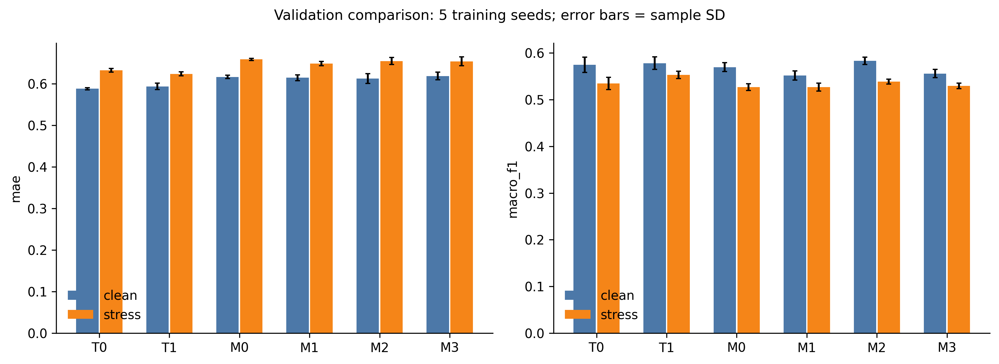
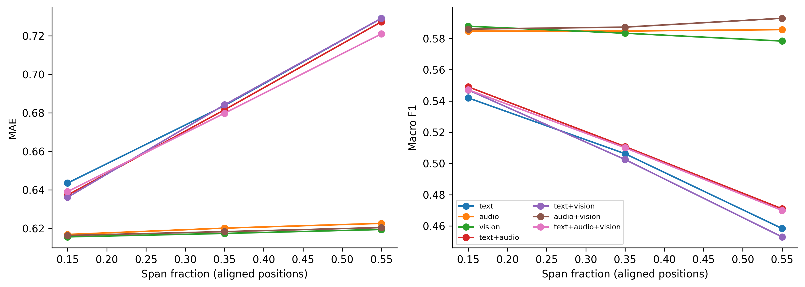
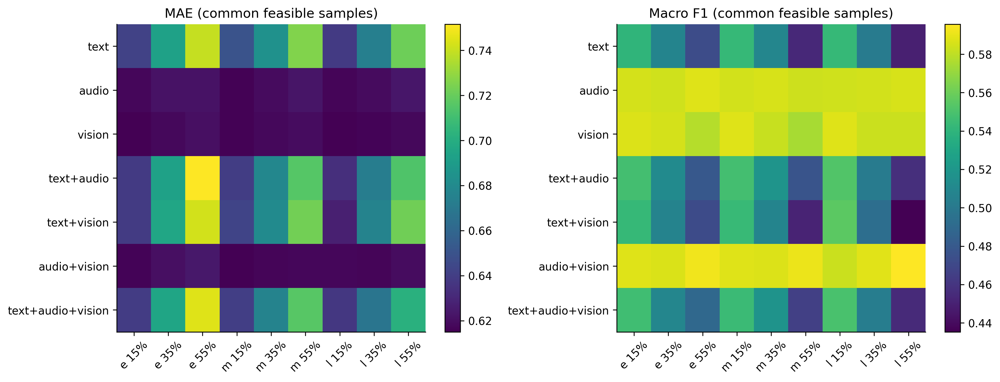
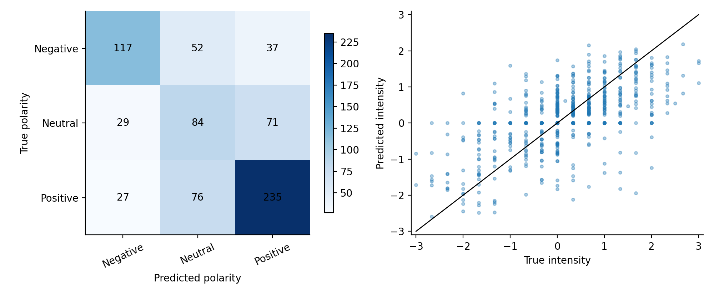
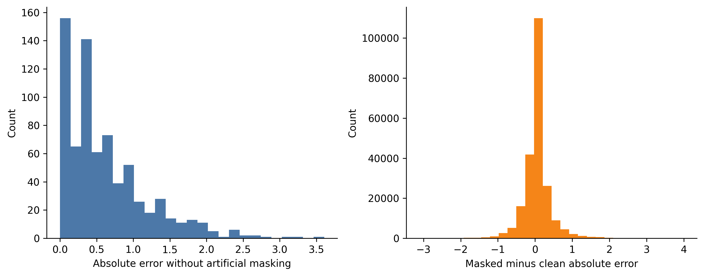
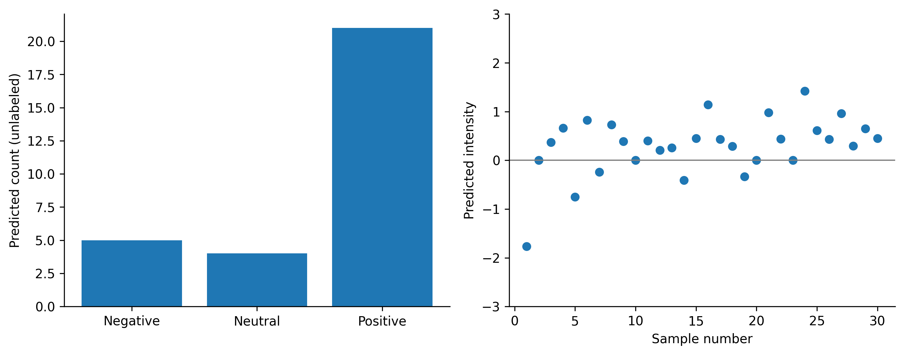

# 问题2：局部连续模态缺失下的情感预测建模与验证

> 第二轮实测结果稿。验证集同时用于选择与诊断，以下结果不代表独立测试集泛化性能。附件3无标签，只进行最终推理。

## 数据及缺失定义

使用附件2 aligned_50 的3395条训练样本学习模型参数，728条验证样本进行选择和诊断。归一化仅使用训练集；附件2 test 未用于本实验。输入为50个对齐位置的文本768维、语音74维、视觉35维特征。文本使用固定BERT重新编码，缺失内容替换为token 100并保留原位置，不删除token；语音/视觉全零行作为不可用观测。

数据审计发现训练集110条、验证集15条样本的视觉模态原本完全不可用。按样本ID中视频前缀分组，训练集包含1528个来源、验证集239个来源，两个划分没有相同来源前缀。训练阶段保留原有缺失样本；人工遮蔽不可行时该增强视图保持原样，实际增强比例见mask_protocol.json。

人工遮蔽为单个连续区间，要求每个目标模态至少移除一个原观测且至少保留一个原观测；不可行条件剔除该样本—条件并单独统计，不缩短区间。原数据的天然整模态缺失不冒充人工局部缺失。时长以内容对齐位置数和比例度量，数据没有秒级时间戳。前/中/后按缺失区间中心所属三分之一区域定义。联合缺失采用同一区间同步遮蔽。

## 模型结构与目标函数

每个模态以观测位置的均值、标准差及前中后三段均值组成5d维输入，投影为64维。可靠性门根据三个模态表示和可用比例生成权重；无门控对照按可用比例归一化。加权表示拼接并与加权和、覆盖率输入128维融合层，分别输出三分类logits和经3·tanh约束的强度。文本基线将其他模态输入及覆盖率置零。

损失 L=SmoothL1(y_hat,y; beta=0.5)+0.7·WeightedCE(c_hat,c)，类别权重由训练集类别频次平方根倒数确定。AdamW学习率0.001、权重衰减0.0001、batch128，最多30轮、耐心值6。所有组每轮使用1个原始视图和3个视图槽；无增强组重复原样本，匹配增强组的每轮更新次数。5个种子为2026至2030，相同种子共享缺失视图、顺序和同形状模块初始权重。

文本人工缺失在冻结BERT编码之前施加，完整与受损输入采用同一编码流程。原训练/验证文本没有[UNK]，因此将原生[UNK]视为可用或不可用在这两个划分上结果相同；附件3中[UNK]代表缺失仍为接口假设，未依据附件3预测分布调整规则。

语音和视觉按训练集观测行拟合逐维均值与标准差，标准差下限0.001，标准化值裁剪至[-10,10]。模态投影为Linear→LayerNorm→GELU→Dropout(0.15)，融合层采用同类结构、Dropout(0.20)。门控logit为线性函数加log(coverage)，无观测模态屏蔽后softmax；固定对照使用coverage/sum(coverage)。训练集增强从7种非空模态组合等概率抽取，连续长度比例均匀抽取10%–70%，每种子预先生成3个视图并跨模型复用。

## 选择与输出规则

按固定验证掩码选择：S=MAE_clean+mean(MAE_grid)+0.6[2−F1_clean−mean(F1_grid)]。每个候选检查点先从0至0.30、步长0.05中选择中性阈值τ，再计算同口径S。强度绝对值≤τ时输出Neutral及0，否则按强度正负号输出极性；三分类头仍参与辅助训练。统一解码的代价与双头原始/校准输出比较见decoding_comparison.csv。

最终多模态配置按5个种子的平均选择分数确定为 **M2**，固定使用种子2026的早停检查点，τ=0.20。未挑选5个种子中最优者。

## 基础性能与鲁棒性

T0/T1为文本无/有增强；M0/M1为无门控多模态无/有增强；M2/M3为有门控多模态无/有增强。clean表示无额外人工缺失，仍允许原数据已有缺失。stress为63条件×5套掩码的等权平均。表中为5训练种子的均值±样本标准差。

| 模型 | 条件 | Accuracy | Macro-F1 | MAE | Pearson r |
|---|---|---:|---:|---:|---:|
| T0 | clean | 0.5978 ± 0.0167 | 0.5750 ± 0.0165 | 0.5878 ± 0.0028 | 0.6404 ± 0.0076 |
| T0 | stress | 0.5609 ± 0.0121 | 0.5350 ± 0.0132 | 0.6321 ± 0.0044 | 0.5652 ± 0.0079 |
| T1 | clean | 0.5984 ± 0.0075 | 0.5782 ± 0.0135 | 0.5934 ± 0.0077 | 0.6274 ± 0.0127 |
| T1 | stress | 0.5704 ± 0.0039 | 0.5531 ± 0.0079 | 0.6235 ± 0.0048 | 0.5811 ± 0.0108 |
| M0 | clean | 0.5893 ± 0.0128 | 0.5698 ± 0.0095 | 0.6162 ± 0.0041 | 0.6082 ± 0.0085 |
| M0 | stress | 0.5484 ± 0.0063 | 0.5271 ± 0.0071 | 0.6583 ± 0.0028 | 0.5349 ± 0.0111 |
| M1 | clean | 0.5703 ± 0.0093 | 0.5518 ± 0.0098 | 0.6143 ± 0.0072 | 0.5955 ± 0.0165 |
| M1 | stress | 0.5479 ± 0.0072 | 0.5271 ± 0.0085 | 0.6482 ± 0.0049 | 0.5503 ± 0.0179 |
| M2 | clean | 0.6005 ± 0.0096 | 0.5834 ± 0.0079 | 0.6123 ± 0.0115 | 0.6097 ± 0.0088 |
| M2 | stress | 0.5563 ± 0.0106 | 0.5386 ± 0.0053 | 0.6545 ± 0.0085 | 0.5408 ± 0.0070 |
| M3 | clean | 0.5750 ± 0.0146 | 0.5560 ± 0.0088 | 0.6186 ± 0.0091 | 0.6031 ± 0.0112 |
| M3 | stress | 0.5486 ± 0.0088 | 0.5296 ± 0.0062 | 0.6537 ± 0.0107 | 0.5528 ± 0.0150 |

### 消融及配对区间

采用同一视频来源组的2000次配对bootstrap，重复遮蔽不作为独立样本。区间反映验证来源抽样不确定性，训练种子波动另以上表标准差描述。验证集曾参与选择，区间不能消除选择偏差。

| 比较（左−右） | 指标 | 差值 | 95%区间 |
|---|---|---:|---|
| M3−M2 | macro_f1 | -0.0091 | [-0.0210, +0.0021] |
| M3−M2 | mae | -0.0008 | [-0.0134, +0.0126] |
| M3−M1 | macro_f1 | +0.0025 | [-0.0078, +0.0131] |
| M3−M1 | mae | +0.0055 | [-0.0058, +0.0155] |
| M3−T1 | macro_f1 | -0.0235 | [-0.0419, -0.0057] |
| M3−T1 | mae | +0.0302 | [+0.0145, +0.0473] |
| M1−M0 | macro_f1 | -0.0001 | [-0.0140, +0.0131] |
| M1−M0 | mae | -0.0101 | [-0.0226, +0.0025] |
| M2−M0 | macro_f1 | +0.0115 | [-0.0004, +0.0237] |
| M2−M0 | mae | -0.0039 | [-0.0182, +0.0107] |
| T1−T0 | macro_f1 | +0.0181 | [+0.0059, +0.0294] |
| T1−T0 | mae | -0.0086 | [-0.0247, +0.0075] |

所选多模态M2的压力MAE为0.6545，文本基线中较低者T1为0.6235；差值为+0.0310。多模态优势不能从网络结构直接推定，应结合四项指标和配对比较解释。

### 缺失类型、位置及长度

全网格包含7种非空模态组合、前中后3位置、15%/35%/55%三长度，每格5套固定掩码。为避免样本组成变化，以下规律使用所有诊断条件都可行的共同子集（n=679）；全部可行样本结果另见missingness_grid_v2.csv。该共同子集偏向观测较完整、能满足区间约束的样本，不能代表全部验证样本。

按模态分组，对其余因素等权平均：

| 水平 | MAE | Macro-F1 |
|---|---:|---:|
| text | 0.6854 | 0.5022 |
| audio | 0.6198 | 0.5851 |
| vision | 0.6175 | 0.5832 |
| text+audio | 0.6820 | 0.5103 |
| text+vision | 0.6831 | 0.5009 |
| audio+vision | 0.6183 | 0.5888 |
| text+audio+vision | 0.6799 | 0.5091 |

按位置分组，对其余因素等权平均：

| 水平 | MAE | Macro-F1 |
|---|---:|---:|
| early | 0.6615 | 0.5429 |
| middle | 0.6539 | 0.5402 |
| late | 0.6500 | 0.5368 |

按长度分组，对其余因素等权平均：

| 水平 | MAE | Macro-F1 |
|---|---:|---:|
| 0.15 | 0.6292 | 0.5634 |
| 0.35 | 0.6550 | 0.5407 |
| 0.55 | 0.6812 | 0.5156 |

上述为固定协议下的描述性关系，不把组合缺失差异单独归因于某一个模态，不保证每个条件都单调。

## 验证可视化及错误分析

| 真值类别 | 样本数 | clean召回率 | clean MAE |
|---|---:|---:|---:|
| Negative | 206 | 0.5680 | 0.7950 |
| Neutral | 184 | 0.4565 | 0.3300 |
| Positive | 338 | 0.6953 | 0.6740 |

遮蔽前后类别转移（统计单位为样本—条件实现，重复样本不独立）：{"correct_to_wrong": 22416, "wrong_to_correct": 12431, "both_correct": 111269, "both_wrong": 76759}

按固定规则抽取6个不同样本的最大误差增量案例和6个固定随机案例，详见error_cases.csv。以下是可观测的错误变化，不能仅由变化认定语义或音视频层面的因果机制：

- `31474$_$6`：text+audio，early，区间比例55%；真值-2.667，clean -2.591，遮蔽后1.407，绝对误差变化+3.997。文本：This movie was quite possibly the worst movie I've ever seen in my life
- `89835$_$7`：text+audio+vision，middle，区间比例35%；真值-2.333，clean -1.851，遮蔽后1.911，绝对误差变化+3.762。文本：(uhh) There are a few (uhh) good moments in there, (umm) however I really didn't, (uhh) really didn't enjoy the film all that much
- `258654$_$3`：text+audio+vision，early，区间比例15%；真值-2.333，clean -1.642，遮蔽后1.811，绝对误差变化+3.453。文本：This is a really bad movie, it has no plot whatsoever and I really had high hopes for it because at his best Will Ferrell can be (uhh) apparently zany and funny, but spent a lot of money advertising (uhh) this movie, had multiple spots during the superbowl
- `188343$_$12`：text+audio+vision，middle，区间比例35%；真值-2.000，clean -2.444，遮蔽后1.662，绝对误差变化+3.218。文本：(uhh) But all in all it's it's (stutter) not a very good movie and so I would not recommend it
- `99501$_$10`：text+audio，late，区间比例55%；真值-1.667，clean -0.877，遮蔽后2.021，绝对误差变化+2.898。文本：(uhh) The special effects are nice, but not enough to warrant any kind of purchase or rental
- `2S00zYaVrtc$_$10`：text+audio，early，区间比例15%；真值-2.667，clean -1.464，遮蔽后1.414，绝对误差变化+2.878。文本：The pepper spray incident was one that I will deeply regret for the rest of my life.
- `wF8980oGklk$_$6`：text+audio+vision，late，区间比例55%；真值0.000，clean 0.731，遮蔽后0.940，绝对误差变化+0.209。文本：They were using CENTORRINO as well and had good reports back about those so we thought we'd have a chat
- `Q4WzApjaCNI$_$0`：text+audio，late，区间比例15%；真值0.667，clean 0.537，遮蔽后0.466，绝对误差变化+0.070。文本：So Wagner talked him into building a special theater just for these productions
- `tXQpm-nKxNA$_$5`：text+vision，late，区间比例15%；真值1.667，clean 1.235，遮蔽后0.283，绝对误差变化+0.952。文本：For those of you already pursuing an education abroad I'm very grateful and wish you well.
- `CJGuudyvA0Y$_$4`：text+audio+vision，middle，区间比例55%；真值-0.667，clean 0.323，遮蔽后-0.512，绝对误差变化-0.835。文本：Don't end up in this situation track all of your human resources and make sure everyone who works for you is under contract from the beginning and keep it all organized and loaded in IncMind.
- `80566$_$3`：audio+vision，late，区间比例55%；真值0.333，clean 0.000，遮蔽后0.000，绝对误差变化+0.000。文本：You see references you know Luke I am your father but with somebody else's name
- `f_ZJ7L14oYQ$_$27`：audio+vision，early，区间比例55%；真值1.667，clean 0.820，遮蔽后0.571，绝对误差变化+0.249。文本：So what I found is that I just pop these over my tennis shoes and I don't have to worry about it anymore.

## 附件3全量预测

模型、阈值和预处理冻结后对30条无标签样本推理，CSV为attachment3_predictions_v2.csv；预测类别分布不是分类准确率。

| 样本 | 极性 | 强度 |
|---|---|---:|
| 附件3_01 | Negative | -1.767531 |
| 附件3_02 | Neutral | 0.000000 |
| 附件3_03 | Positive | 0.369550 |
| 附件3_04 | Positive | 0.662204 |
| 附件3_05 | Negative | -0.749296 |
| 附件3_06 | Positive | 0.825585 |
| 附件3_07 | Negative | -0.243440 |
| 附件3_08 | Positive | 0.733029 |
| 附件3_09 | Positive | 0.387620 |
| 附件3_10 | Neutral | 0.000000 |
| 附件3_11 | Positive | 0.402808 |
| 附件3_12 | Positive | 0.205481 |
| 附件3_13 | Positive | 0.256715 |
| 附件3_14 | Negative | -0.410827 |
| 附件3_15 | Positive | 0.449290 |
| 附件3_16 | Positive | 1.139218 |
| 附件3_17 | Positive | 0.433539 |
| 附件3_18 | Positive | 0.291064 |
| 附件3_19 | Negative | -0.334336 |
| 附件3_20 | Neutral | 0.000000 |
| 附件3_21 | Positive | 0.979100 |
| 附件3_22 | Positive | 0.440109 |
| 附件3_23 | Neutral | 0.000000 |
| 附件3_24 | Positive | 1.420415 |
| 附件3_25 | Positive | 0.609592 |
| 附件3_26 | Positive | 0.434051 |
| 附件3_27 | Positive | 0.962239 |
| 附件3_28 | Positive | 0.296611 |
| 附件3_29 | Positive | 0.649911 |
| 附件3_30 | Positive | 0.448708 |

## 局限与复现

模型使用分段统计而非完整时序编码，不能据此宣称已精确定位情感转折；缺失时间为对齐步数代理；全零行和UNK的缺失解释有接口假设；只评估同步组合缺失；验证集兼用于选择，缺乏独立有标签专项测试。增强失败或模态收益不稳定的结果同样保留。

复现需固定BERT版本、环境、掩码和配置，详见config_v2.json、environment_server.txt、environment_packages.txt、data_audit.json、frozen_model.json以及代码README。BERT权重和原始数据不放入50MB提交附件；输出文件均为派生结果，原附件保持只读。

## 结果解释与词段审阅补充

文本增强T1相对T0的压力Macro-F1提高0.0181，95%来源分组配对区间为[0.0059,0.0294]；其余三项指标的差值区间跨0。M3相对M2及M1的四项差值区间均跨0，尚无足够证据认定多模态增强或门控产生稳定收益。M3相对T1的Macro-F1降低0.0235，MAE增加0.0302，区间均不跨0，说明完整多模态增强方案在本次固定协议下弱于文本增强基线。M2按事先固定的clean与压力联合评分在多模态范围内被选择，不代表它优于所有文本候选。验证集参与了选择，上述区间不能消除选择偏差。

在共同可行子集上，缺失比例从15%增至55%时，MAE由0.6292增至0.6812，Macro-F1由0.5634降至0.5156。文本缺失的MAE为0.6854，高于语音缺失0.6198和视觉缺失0.6175。位置效应则依赖任务：前段缺失的回归误差更高，后段缺失的分类F1更低，因此不能给出分类与回归共同支持的唯一最坏位置。组合缺失存在非单调现象，不据此认定某种确定的跨模态补偿机制。

以M2的五种子压力均值比较，同一检查点上的原始双头输出为Accuracy 0.5628、Macro-F1 0.5318、MAE 0.6614、Pearson 0.5459；统一解码后分别为0.5563、0.5386、0.6545、0.5408。输出语义一致性伴随分类准确率和相关系数的部分损失，不能宣称该规则全面改善性能。该比较未为双头规则重新选择训练检查点。

为核实错误解释，进一步把预先选定的12例区间映射回原始WordPiece词段，完整记录见error_cases_token_audit.csv。样本31474$_$6的受损区间包含“the worst movie”，89835$_$7包含“however i really didn ' t”，258654$_$3包含“bad movie , it has no plot”，99501$_$10包含“but not enough to warrant any kind of purchase or rental”；这些负向样本均出现负转正，与核心情感或否定信息受损的解释一致。固定随机案例tXQpm-nKxNA$_$5遮蔽“grateful and wish”后，强度从1.235降至0.283，也显示情感线索受损对应预测变化。由于部分案例同时遮蔽其他模态，这些观察不能隔离某一个词的因果贡献。

反例2S00zYaVrtc$_$10仅在文本部分遮蔽“spray incident was”，并未直接移除regret，仍发生负转正，说明否定词丢失不足以解释全部错误；CJGuudyvA0Y$_$4在遮蔽后误差反而下降，可能涉及干扰信息减少或模型误差抵消，尚无机制证据。分类别看，负向强度误差最高，中性召回率最低，因此当前方案的主要局限包括负向强度估计和中性边界识别。完整解读及最终单检查点口径另见Q2结果解读.md。
