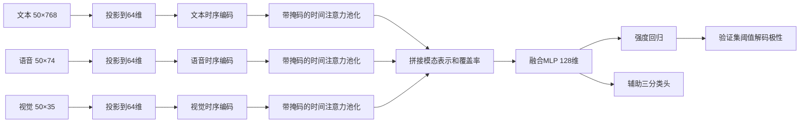

# Q3：数据审计、模型搭建与解释验证方案

版本：2026-09-25，设计 v1。此文保留预定方案；**实际第一轮结果与实施差异**见[RESULTS.md](RESULTS.md)。

## 1. 正式题目与验收对应

来源：[正式赛题](../复杂场景下多模态情感识别的数学建模与算法设计.docx)，第三条问题3、第四条问题3相关内容、第五条特征说明。该 Word 文件是题目文件。

题目要求：在三模态完整的场景下，同时输出情感极性、强度、主要参考模态、三模态作用程度与局部证据；证据可对应原文本片段、语音时段或视觉关键帧。需提交附件4全部预测与解释 CSV，并在正文呈现模型、训练、典型解释卡、重要性分布、验证性能及错误归因。

| 要求 | 拟交付材料 | 完成标准 |
|---|---|---|
| 数据可追溯 | 输入哈希清单、逐样本审计、位置映射 | 数据版本一致；每条记录可回溯原文件 |
| 模型与求解 | 模型代码、配置、参数、环境、训练日志 | 附件2 train 学习参数；valid 选择结构和阈值 |
| 基础性能 | Accuracy、Macro-F1、MAE、Pearson；混淆矩阵、散点、类别误差 | 同一批验证样本、5种子均值与标准差，另报最终检查点 |
| 模态作用 | 三模态贡献、有符号方向、主要参考模态 | 指定解释目标和参考输入；贡献可重算 |
| 局部证据 | 文本位置、特征区间、视频时间与帧映射 | 特征索引与物理时间分别记录，映射依据可复核 |
| 解释验证 | 扰动、随机对照、参考输入敏感性、参数随机化 | 报告实际通过和未通过的检验，不预设结论 |
| 专项输出 | 20条预测、20条解释汇总、证据长表及解释卡 | ID完整唯一；无标签测试不计算准确率 |

约束：全部训练、调参只使用附件2规定的 train/valid；不使用附件2 test 标签和附件3做 Q3选择。附件4仅做接口/素材质量检查，冻结模型与解释规则后做最终推理；不根据其预测分布调阈值。Q1+Q2+Q3总附件≤50MB，不能给Q3单独占用50MB。

## 2. 已核实的数据事实

依据 [audit.json](audit/initial/audit.json) 与 [sample_inventory.csv](audit/initial/sample_inventory.csv)，由 `audit_q3.py` 实际读取生成。

| 数据 | 样本数 | 有效内容位置数 | 内容位置视觉全零的样本数 |
|---|---:|---:|---:|
| 附件2 train | 3395 | 1–48 | 110 |
| 附件2 valid | 728 | 1–48 | 15 |
| 附件4 对齐版本 | 20 | 11–48 | 1（ID=13） |

- 附件2输入哈希：`66e867aa74bc70a844e806e5571e371c9abb4a35f9e2887ce9b4d97ff2cb8fcd`，与Q2训练来源一致。
- 三模态单样本接口：`text (50,768)`、`audio (50,74)`、`vision (50,35)`；`text_bert (3,50)`。50是存储长度，不能作为有效长度或视频时长。
- 附件4每个PKL直接保存单样本字典，没有附件3的 `test` 外层与大小为1的批次维。`id`为01–20；视频位于 `videos/同名.mp4`。20对文件名、ID及哈希已登记，视频解码与语义配对尚未验证。
- 三部分内容位置均无 `[UNK]`。Q3仍保留 `[UNK]` 作为普通未知词元；不复用Q2的100号词元缺失约定。
- 已检查数值有限性与形状；train/valid强度范围及极性符号一致。类别计数（负/中/正）：train=967/758/1670，valid=206/184/338。
- train/valid没有交叉ID、来源视频组或逐字节相同的四字段特征组合；分别1528/239个来源组。有2种文本在转小写、合并空白后跨划分重复，需要记录关联ID并做敏感性分析；不能据此直接认定泄漏或删除官方样本。
- 三部分均有文本特征在内容位置之外非零，因此不能根据 `text != 0` 判断文本有效长度。A/V在内容位置之外未发现非零行。
- 附件4全部20条都没有名称含time的字段；题目也明确附件2没有逐词时间戳。结构审计不证明特征行已经与词或物理时间正确匹配。

全零特征只能先标记为 `zero_feature_indicator`。完整素材仍可能出现特征提取失败或无脸，不能据此声称题目人为加入了缺失。13号样本保留并输出数据质量说明。

## 3. 分阶段数据审计

### A. 输入与划分（进入训练前）

1. 扩展已有清单：保存字段类型、有效长度、padding/特殊词元、非有限值、全零连续段、常量维度、极端值及类别分布。
2. 用词元注意力掩码排除PAD、CLS、SEP，单独记录UNK；审计特殊词元ID与词表版本。依据提供的结构说明及词元映射核实A/V同行含义，不默认“一个位置就是一个单词”。
3. 补全重复文本的关联ID、标签一致性与特征差异。官方全验证集仍作主报告，同时报告排除这些重复文本样本后的敏感性结果，不改变训练标签。
4. 标准化仅拟合train的有效观测行。A/V均值和标准差、下限1e-3、标准化后裁剪[-10,10]单独保存；不使用valid或附件4重估。
5. 为全零模态规定数值安全路径：用显式观测掩码及可学习空表示，禁止全部mask时softmax生成NaN。该路径在train数据上定义并测试，不能因附件4的个别结果改规则。
6. 给训练代码传递专门train/valid视图，禁止访问test标签。全部派生输出放Q3独立目录。

### B. 特征→词→原视频（解释定位前）

映射链必须逐段有证据：

`feature_index → token_index/word_index → raw_text字符区间 → 词时间区间 → 视频PTS/帧`

1. 固定词表和tokenizer版本，对raw_text重新分词；逐条比较已有 `text_bert` 的ID序列、特殊词元与截断。仅在匹配成立时使用offset mapping，合并WordPiece还原词；不匹配标记为unresolved。
2. 核查文本序列位置和A/V对齐位置的关系。分词一致只能证明token与文本对应，不能单独证明原A/V聚合窗口也是相同词元。优先查随附生成说明/元数据；必要时进一步查特征生成代码。没有依据时不输出伪精确时间。
3. 解码附件4全部20段视频，记录时长、音轨、采样率、帧时间PTS、静音区间与解码失败。核查给定raw_text与原音频是否对应，不替换原转写。
4. 复用Q1的强制对齐流程，为原文本产生候选词起止时间、算法版本、置信信息、失败原因；这部分仅补定位元数据，不把Q1的27维音频/15维视觉替换进Q3标准输入。
5. 所有最终解释卡引用的主要证据区间都回看视频/音频；自动检查0≤start<end≤duration、词顺序、帧PTS及异常长词段。人工检查需真实复核者记录，机器复核不写成人工验收。
6. 人工边界参考未提供时，字段 `human_verified=false`，不能报告人工边界准确率。低置信或无法映射的时间留空，显示原文字符和特征索引及原因。

若主要模态是音频或视觉而仍不能可靠映射原素材，相关证据定位项保持未完成；不得靠等分视频时长填齐CSV。若只完成文本定位，可以先交付可核查文本证据，但不能宣称所有三模态定位已完成。

## 4. 模型设计

### 4.1 采用对齐版本与标准text字段

主线使用附件2/4提供的连续 `text` 特征，A/V分别74/35维。避免先用一套BERT表示训练、再用未经校验的另一套表示解释。`text_bert`用于词元定位与后续原文扰动验证；它不构成第四模态。

主模型候选C3：

每个模态独立：Linear→LayerNorm→GELU→固定正弦位置编码→1层TransformerEncoder（d_model=64，4头，FFN=128，dropout=0.15）。时间池化 `α_mt=softmax_t(w_m^T tanh(W_m h_mt))`，`z_m=Σ_t α_mt h_mt`。拼接三个64维表示与3项观测覆盖率，进入128维MLP。

`r=3 tanh(w_r^T z+b_r)`；辅助分类输出3个logits。注意力是模型内部汇聚系数，先单独命名 `attention_weight`，解释贡献用第5节的扰动方法计算。

位置编码只代表特征序列位置。各模态编码器会传播上下文，所以局部注意力较高不等价于该位置的原始信息独立贡献大。

### 4.2 目标函数与输出一致性

`L = SmoothL1(r,y; beta=0.5) + 0.7 × weighted_CE(logits,c)`。

类别权重按train类别频数倒数平方根计算并归一化。类别真值固定为强度负/零/正，禁止通过阈值改写真值。

最终报告强度 `r_out=0 (|r|≤τ)`，否则 `r_out=r`；最终极性由 `r_out` 的符号唯一确定。保存未阈值化的raw_intensity供解释。辅助分类头不单独决定提交极性，避免两个头输出冲突。

### 4.3 训练与选择

- AdamW，学习率1e-3，weight_decay=1e-4，batch=128，最多40epoch，patience=8，梯度裁剪1.0，种子2026–2030。
- 主线使用完整观测数据，不做Q2式随机连续缺失增强。train本来存在的全零行按统一质量处理规则保留。
- 在官方valid内部按来源组固定划分约60%选择部分与40%诊断部分，划分种子6201。实现时按样本比例与类别比例偏差选取确定性划分，不根据模型表现选择划分。保存全部ID，来源组不交叉。
- 每epoch只在选择部分搜索 `τ∈{0,.05,.10,.15,.20,.25,.30}`，最小化 `J=MAE+0.6×(1−Macro-F1)`；并列依次用较小MAE、较小τ、较早epoch。
- 每个架构5种子，以平均J选架构；并列选择参数更少者。最终固定seed2026，禁止挑选最好种子冒充代表检查点。
- 诊断部分在模型与解释规则冻结后评价；同时报告全valid的四指标，但全valid包含选择样本。Q2已经使用过全部valid，因此新划分仍不是从未接触过的独立测试集，需在论文声明此限制。
- 使用Q2的已训练M2/T1作历史参考；新主比较必须按Q3相同划分重新训练。不能直接拿Q2全valid调参的模型作为新诊断集上的独立对手。

### 4.4 有界实验矩阵

| 编号 | 结构 | 目的 |
|---|---|---|
| C0 | 仅文本，时序编码+注意力池化 | 检验A/V是否带来实际收益 |
| C1 | Q2式多模态统计池化+门控，重新训练 | 可复用的低成本多模态基线 |
| C2 | 三模态时序编码+masked mean池化+拼接 | 检验序列表示及均值汇聚 |
| C3 | 三模态时序编码+时间注意力池化+拼接 | 主解释候选；与C2比较注意力作用 |

共4架构×5种子=20次拟合。C0与C3共享文本编码设定；C2/C3尽量匹配其他参数。C1结构不同，因此C1/C3是整体方案对比，不能归因于单一组件。

正式多模态模型从C1/C2/C3按J选择；C0始终报告。如果C0更好，明确披露多模态性能代价。解释方法适用于全部多模态候选，不能为保留漂亮注意力图而指定C3胜出。

本轮设计没有提交GPU作业。实施时先跑小批量前向/反向与1epoch冒烟，测时间/内存后再给单卡正式作业设时限，避免承诺尚未测量的耗时。

## 5. 解释：分开定义模态作用与局部证据

### 5.1 两种解释目标

对原预测固定类别k与阈值τ，在所有扰动中固定k：

- 强度目标 `g_reg(x)=r(x)`：正贡献把强度推向正向，负贡献推向负向。
- 极性目标为原预测类别的决策余量：Positive时 `g_cls=r−τ`；Negative时 `g_cls=−r−τ`；Neutral时 `g_cls=τ−|r|`。这不是概率。正贡献支持原类别，负贡献反对原类别。

中性样本同样可以解释；不能把强度绝对值接近零当作“没有模态作用”。

### 5.2 三模态精确Shapley分解

三模态只有8个子集，可逐一前向评估。对于S中保留的模态使用当前样本，其他模态的有效观测向量替换为train有效观测向量均值；原padding、位置与观测掩码固定，模型处于eval模式。A/V标准化后的均值约为0，文本参考向量须单独从train拟合。自然无观测位置继续走原空表示路径。

`φ_m = Σ_{S⊆M\{m}} |S|!(2−|S|)!/3! × [g(x_{S∪{m}})−g(x_S)]`。

保存8个原始子集分数、基线 `g(x_empty)`、3个有符号贡献。检查 `Σφ_m = g(x_full)−g(x_empty)`，允许误差 `1e−5×(1+|g(x_full)|)`。这是指定参考输入下的模型分解，不是现实世界的因果效应。

作用程度：`w_m=|φ_m|/Σ|φ|`，以极性目标为主。若分母<1e−6，输出 `primary_modality=undetermined` 与原因；否则主要参考模态取绝对贡献最大者，近似并列（差<1e−6）报告并列。另存最大正贡献模态 `top_support_modality`，防止把强烈反对预测的模态写成主要支持证据。

### 5.3 局部重要性

主解释采用输入特征区间替换产生的预测变化；注意力作为辅助对照。

- 在已验证的词映射上合并WordPiece成词，按词组成连续候选区间。映射未完成时只使用连续内容位置，标注单位为feature_position。
- 对每个模态遍历候选区间，替换为与模态分解相同的参考向量；以 `Δ=g(x)−g(x_without_span)` 排序。分别保存支持、反对及绝对影响，其他模态保持原输入。
- 主证据预算为该模态有效单位20%；同时评估10%和30%。短样本使用向上取整且不超过有效长度。最终显示最多3个不重叠区间，实际覆盖数量必须记录。
- 删除曲线的排名在原样本上计算一次并冻结；增大预算后不能依据已删输入重新选择有利排名。
- 局部区间有重叠、上下文与模态交互，其分数不能当作可加总的Shapley贡献，也不要求合计等于模态贡献。

关键限定：提供的text是上下文表示。遮蔽某一行检验的是该表示行对预测的作用，周围行可能仍包含该词语义。解释卡明确标记 `representation_intervention`；未经重新编码验证，不写成“删去原词必然改变情感判断”。

### 5.4 原文删除验证与参考输入敏感性

在选择部分先核对固定BERT版本对原输入重编码能否复现给定text：记录逐位置误差、padding处理、dtype和版本。只有满足预先规定的数值容差（建议float32最大绝对误差≤1e−4，并同时记录相对误差）才对删除/替换原词后重新编码的预测变化作同模型解释；不一致则保留为未完成验证，不混用特征空间。

为检查参考向量导致的伪效应，再从train选16个固定随机参考样本（seed6202，长度分箱匹配；同一参考保持三模态配对），将有效序列按内容相对位置最近邻映射到当前长度，重复贡献与局部排序。报告符号、主要模态和区间排名稳定性，说明重采样及参考选择本身的限制。参考样本不能来自附件4。

## 6. 解释验证实验

先在选择部分调试实现和固定规则；诊断部分统一运行，所有对照使用同一模型、同一样本和同样被替换单位数。

| 检验 | 实施与指标 | 能支持的结论 |
|---|---|---|
| 分解正确性 | 8子集重算、Shapley求和残差、批次前向一致性 | 实现数值正确；本身不证明解释忠实 |
| 删除重要证据 | 10/20/30%支持证据，比较g_cls下降与强度变化 | 移除所选表示是否影响原判断 |
| 随机/低重要性对照 | 每样本10个等长度随机连续区间；最低重要性区间 | 是否比任意同长度删除更有效 |
| 仅保留证据 | 将其余有效位置替换，报告g差、类别保持率、强度偏移 | 证据保留了多少原预测信息 |
| 模态作用方向 | 三模态分别替换；与φ符号及排名比较 | 单独移除效应与多模态交互分解的关系 |
| 参考输入敏感性 | 均值参考与16个train参考 | 解释对指定参考的依赖程度 |
| 种子稳定性 | 5模型的主要模态一致率、排名Spearman、证据IoU | 训练随机性下是否稳定 |
| 参数随机化 | 固定seed6203逐级重置输出头/融合层/时序编码器 | 解释是否随被解释模型变化 |
| 注意力对照 | 注意力选区间与扰动选区间做同预算删除 | 注意力能否作为本模型的证据代理 |

评价时固定原预测k，不在每次扰动后改变解释目标；报告支持区间和反对区间，不能将两者混为“删除后应下降”。中性、负向、正向分别汇总。

主要解释检验预先固定为：在诊断样本上，20%支持证据删除相对等预算随机删除的 `g_cls` 下降差。按来源视频组配对bootstrap 2000次，对10随机对照先在样本内求均值，报告差值与95%区间。只有区间支持正差时才声称该指标上优于随机；无证据时如实报告。其余指标为辅助诊断，不以多次尝试挑选显著项。

参数随机化时，预测目标可能失去语义；报告原类别固定目标的变化和原始输出，不能把“变化越大”单独当作解释质量排名。跨种子若原预测类别不同，分开统计全样本与预测一致样本的解释稳定性。

替换整个模态或大区间可能产生训练分布外输入。原始完整样本四指标用于性能评价；扰动指标只验证模型行为，结合参考敏感性共同解释。不得把“删除后准确率降低”直接证明人类情感原因。

## 7. 可视化、错误分析和输出接口

### 7.1 验证集

基础性能：四指标5种子均值/标准差、最终seed2026单独结果；混淆矩阵；真实/预测强度散点；各类别误差；按长度、全零视觉指示、重复文本分层。配对bootstrap以来源组为单位，不能把扰动重复当成独立样本。

解释图：三模态有符号贡献条形图、主要模态比例、主要模态内局部得分分布、删除/保留曲线、随机对照、种子/参考稳定性。注意力图与扰动重要性图分别标注。

图表同时保存 PNG（预览）、PDF（排版）和 EPS（论文插图）。EPS 后端不支持透明度，绘图使用不透明对象；所有图的标题、单位、图例及数据来源保持一致。提交包按总大小上限选择必要格式，原始绘图数据单独保存。

案例选择规则提前冻结：诊断集各真值类别选误差中位数附近1条、最大绝对误差1条，再按seed6204随机选3条，去重；解释测试失败案例另列。区分模型错误、数据/定位问题与解释方法失效。不能只挑预测正确且图形直观的样本。

### 7.2 附件4最终结果

冻结代码、训练数据哈希、模型参数哈希、归一化、τ、解释参考、证据预算及种子后，推理全部20条。附件4只展示预测与解释，不计算没有真值的性能指标。

| 文件 | 核心字段 |
|---|---|
| `attachment4_predictions.csv` | id, polarity, intensity, raw_intensity, model_hash |
| `attachment4_explanations.csv` | id, primary_modality, top_support_modality, contribution_target, phi_text/audio/vision, weight_text/audio/vision, baseline_score, full_score, evidence_ids, explanation_status |
| `attachment4_evidence.csv` | evidence_id, id, modality, feature_start/end_exclusive, token_start/end_exclusive, char_start/end_exclusive, text_excerpt, start_sec/end_sec, video_frame_pts, signed_score, mapping_status, human_verified |
| `explanations.jsonl` | 8子集分数、两种目标贡献、完整局部得分、参考输入、质量原因及可复算元数据 |
| `cards/` | 每条样本的预测、贡献、主要模态、局部证据、原素材引用、定位与解释质量状态 |

索引全部0起点、右端不包含；时间单位秒；原素材路径相对附件4目录。未知时间用空值，不能写0代替未知。汇总CSV每条样本一行，证据表允许一对多且引用完整。主CSV覆盖20条，解释失败也保留记录和原因。

中性阈值化为0的样本仍保存原回归值和解释参考。没有稳定主要模态的样本允许undetermined，不能通过硬填text凑齐。

## 8. 实施顺序与阶段门槛

| 阶段 | 工作 | 进入下一阶段的条件 |
|---|---|---|
| S0（本次部分完成） | 读取题目；接口、哈希、划分初审；设计冻结 | 本文、4143行审计清单及20对文件清单可查 |
| S1 | 补深度质量审计、分词/对齐含义核验、valid分组清单 | 掩码与标签规则明确；阻断性接口问题解决 |
| S2 | 实现4候选、关键单元检查、1epoch冒烟 | forward/backward有限；padding不影响输出；全零模态安全 |
| S3 | 20次正式拟合；选择结构、阈值；冻结预测器 | 所有拟合和选择依据留档；四指标及文本对照齐全 |
| S4 | 解释器数值检查、选择部分调试、诊断部分验证 | 忠实性结果有证据；失败原因披露；不以注意力替代验证 |
| S5 | 原视频定位与复核、20条冻结推理及解释卡 | 主证据可对应原素材；异常样本及定位未完成项明确 |
| S6 | 正文材料、CSV/模型/代码复现、总附件体积检查 | ID覆盖、范围/符号、引用、复现和总大小检查通过 |

S1的素材对齐工具验证可与S2模型代码准备并行推进，但附件4上的质量处理只补定位元数据，不根据最终预测改善模型。阶段未达门槛时完成独立工作并记录具体缺口；不能用“已有漂亮图表”替代解释证据。

## 9. 第一轮实施说明

S0–S4的主要程序和结果已完成，S5已完成20段自动词时间候选、20条预测与解释卡；S6已生成Q3单独轻量包并核对匿名关键字和压缩包完整性。116条证据都有自动时间候选；02号两条候选跨越不发音的连字符，按周围已对齐词包络确定。人工时间真值仍未提供，Q1/Q2/Q3合包体积尚未最终核验。

与本设计的差异：实际选中C2，因此没有把C3注意力作为最终解释；参考敏感性使用16个来自同一训练样本的三模态观测行向量，没有执行完整配对序列替换；文本扰动采用WordPiece `[MASK]` 后BERT重编码，没有直接删除原单词；物理时间来源于Q1的CTC自动候选，尚无人工核验。具体数值与审慎结论以[实际结果](RESULTS.md)为准。
